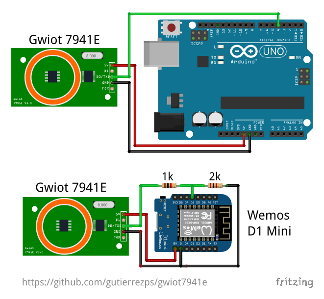

# Gwiot 7941E

A simple library to interface with Gwiot 7941E RFID reader. Based on
[rdm6300 library](https://github.com/arduino12/rdm6300) by
[Arad Eizen](https://github.com/arduino12).

## Features

* Fast and single tag reading
* Using a single configurable GPIO pin
* Both Hardware and Software UART (Serial) support on ESP8266
* Both SoftwareSerial and [AltSoftSerial](https://github.com/PaulStoffregen/AltSoftSerial)
support

## Getting Started

### Hardware

* Gwiot 7941E module
* 125kHz RFID tags
* Microcontroller (Arduino, ESP8266, ESP32...)
* Jump-Wires (resistors of 1k and 2k if you are using a 3.3V based microcontroller).



### Software

A simple RFID tag reader with textual Serial output:
[`examples/read_to_serial/read_to_serial.ino`](examples/read_to_serial/read_to_serial.ino)

```c++
#include <Gwiot7941e.h>

#define GWIOT_7941E_RX_PIN 4
Gwiot7941e gwiot7941e;

void setup()
{
    //...
    gwiot7941e.begin(GWIOT_7941E_RX_PIN);
    //...
}

void loop()
{
    //...
    if (gwiot7941e.update()) {
        Serial.println(gwiot7941e.getLastTagId(), HEX);
    }
    //...
}
```

#### API

* `void begin(Stream *stream)` - Initialize the object to use the given Stream
(i.e. an `AltSoftSerial` object) to read from the 7941E.
* `void begin(int rxPin, uint8_t uartNum=1)` - Initialize the object to use the
given GPIO pin as RX from the 7941E. Use `uartNum` to specify which Serial to
use on ESP8266/ESP32.
* `bool update()` - Updates the internal values by reading from the 7941E, returns
`true` on tag detection, must be called repeatedly!
* `uint32_t getLastTagId()` - Returns the last tag id read by `update()`.

## Additional resources

Here are some additional resources about the Gwiot 7941E RFID reader.

* [Module datasheet (in chinese)](doc/7941E_datasheet_(chinese).pdf)
* Output data format (by QuickFix): <https://www.esp8266.com/viewtopic.php?t=18447>
* Support code for the module (by [Pako2](https://github.com/Pako2)): <https://github.com/esprfid/esp-rfid/pull/196>
